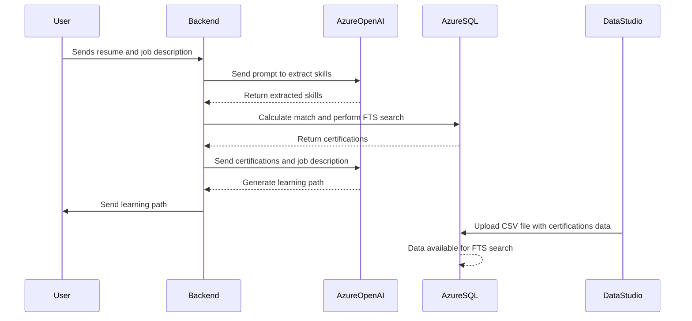

### **Overview**

The **Certification Learning Path Builder** tool is meant for jobseekers transitioning or climbing in tech roles. One major challenge faced by job seekers were creating a learning path catered to their learning goals and ideal job roles.

The Microsoft certifications page requires self-exploration to piece together a learning path. This tool streamlines the process for the job seeker, helping users identify the exact courses or certifications needed based on job requirements and skill gaps.

I wanted to move beyond the typical chatbot interface common in RAG applications. This project showcases how RAG can be used in web applications to aid in data extraction, processing, and providing structured answers (Without dependence on chat UI or embeddings).

### **Using the tool**

Ideally, users will be able to upload their resume as a PDF document, but for now, we’ll use a textbox to capture that information. Users will also provide the job description for the role they’re interested in. Both information are sent to the backend to extract the skills as keywords.

Behind the scenes, an Azure SQL Database is pre-seeded with certifications information from the Microsoft Credentials website. A full-text search is performed on the certification data (the overview and skills section), and retrieves relevant certifications.

The retrieved certifications and job description are sent to **Azure OpenAI**, which reorders and builds a personalized learning path for the job seeker, also providing reasons for each recommendation.

---

### **Experience Using AI and RAG**

Building this solution with AI and RAG was relatively straightforward. Following the provided code examples allowed for quick setup of essential functionalities, such as initiating the client and inference. Ingesting data into the SQL database using Azure Data Studio was done by importing a CSV file. Creating a Full Text Search (FTS) index was easy using query. Configuring Azure OpenAI took a bit longer, but reviewing sample code in the OpenAI Studio playground accelerated the process.

---

### **How RAG Helped Build This Solution**

Using RAG combined with Full Text Search, I was able to retrieve relevant certification information from the database based on required skills. The retrieved documents provided context for the learning path builder, which **Azure OpenAI** used to filter, re-order, and generate a personalized response for the user.

### **Tech Stack**

- Frontend: Fluent2 UI (https://fluent2.microsoft.design/), React
- Backend: NestJS
- DB: Azure SQL Database
- Model: AzureOpenAI and OpenAI (GPT 4.o)
- Tools: Azure Data Studio

### **Datasource**

For the data source, certification information was scraped from the Microsoft Credentials page into a csv file. The data is seeded into an Azure SQL database using Azure Data Studio and FTS index was created via MS query. No embeddings were used.

### **Video Demo**

https://www.loom.com/share/0a5ae8b34b804b5985742a2f8db2e1e7?sid=1e5be39d-e25a-46d2-ab60-68180ae4f591

### Other Potential Audiences

- **Employers and HR Departments**

  - Talent Development: Supporting employees’ professional growth and aligning training with business needs.

- **Educational Institutions**

  - Career Services: Guiding students on certifications and learning paths.
  - Professional Training Providers: Integrating or promoting certification and training programs.

- **Industry Experts and Consultants**

  - Career Coaches: Advising clients on career development and tailored learning paths.

- **Job Boards and Career Platforms**

  - Platform Integration: Enhancing user value with learning path recommendation tools.

- **Product and Service Teams**

  - **Feature Development**: Integrating learning path recommendations into their products or services.
  - **User Experience Enhancement**: Using the tool to improve user engagement with tailored educational paths.

### Sequence Diagram

